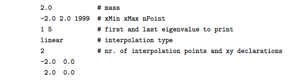

.. Schrödinger Equation Solver in 1D documentation master file, created by
   sphinx-quickstart on Fri Sep  7 15:28:28 2018.
   You can adapt this file completely to your liking, but it should at least
   contain the root `toctree` directive.

Welcome to Schrödinger Equation Solver in 1D's documentation!
=============================================================

Guide
^^^^^

The program consists of 6 python scripts. To solve the Schroedinger Equation for a certain potential
the file main.py has to be executed. The necessary information to specify the problem has to be stored
stored in a file named schrodinger.inp as shown in the following example:

Please make sure you defined the potential at the bounds of the interval.

The program will solve the Schroedinger Equation for the specified problem and save the results in 4 files:
    - potential.dat: contains the interpolated x and y values of the potential
    - wavefuncs.dat: contains the x and y values of the eigenstates of the particle
    - energies.dat: contains the eigenvalues corresponding to the eigenstates
    - expvalues.dat: contains the expected values of the locations and the uncertainties of the particle

When executing main.py you are given the choice to change the default settings. These include:
    - The name of the input file (default: "./schrodinger.inp")
    - The directory the results will be saved in and plotted from (default: "./")

However the default settings dont have to be changed (given that schrodinger.inp is in the default directory).

Aside from the main.py script there is another executable script called plot.py which plots the calculated results from a certain input directory. It will generate 2 diagrams:
    - The left one contains the interpolated potential, the eigenstates (shifted on the y-axis by the eigenvalues) and the expected values of the location of the particle.
    - The right diagram contains the uncertainty in postition of the particle.

When executing plot.py you are given the choice to change the default settings. These include:
    - The directory of the .dat files you want to plot (default: "./")
    - A scaling factor to scale the wave function in the plot by (default: 1.0)
    - An option to change the axis range of the plot (for example: -10,10,-10,10)

The files test_potential*.py in the main directory are only for testing. The necessary reference data is
loaded from the folders test_potentials/test_results*_reference/.

Code
^^^^
.. toctree::
   :maxdepth: 2

   modules
